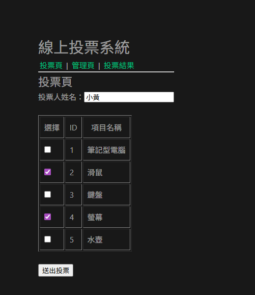
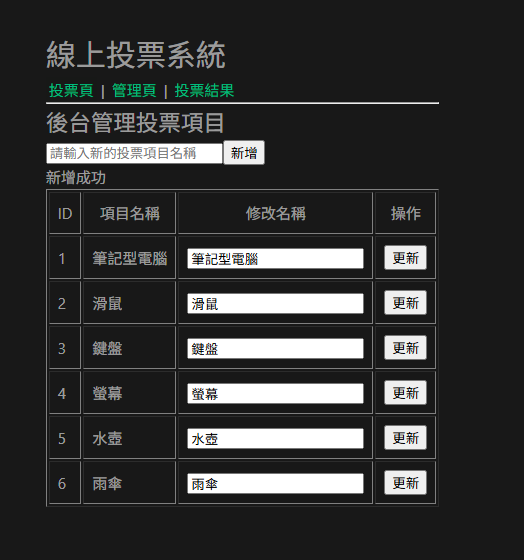
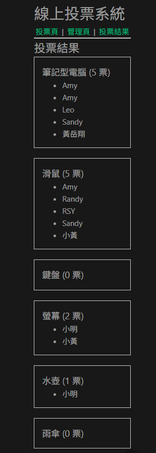

## Voting System 投票系統

一個使用 Spring Boot + Vue.js + MySQL 開發的前後端分離投票系統。

此專案提供投票管理、投票功能、投票統計與詳細投票紀錄查詢，並使用 Stored Procedure 操作資料庫。

## 專案特色 (Project Features)

- 前後端分離架構 (Spring Boot + Vue)
- RESTful API 設計
- 使用 Stored Procedure 操作資料庫
- 支援多選投票
- 投票結果統計

## 系統功能 (System Features)

1. 後台編輯投票項目功能
   - 新增投票項目
   - 修改投票項目
   - 頁面顯示所有投票項目

2. 使用者投票功能
   - 輸入投票人姓名
   - 多選投票
   - 儲存投票紀錄

3. 投票結果統計
   - 顯示每個投票項目的總票數及投票者姓名

## 系統架構 (System Architecture)
    Vue Frontend
        │
        │ Axios
        ▼
    Spring Boot REST API
        │
        │ Service Layer
        ▼
    Repository (JdbcTemplate)
        │
        │ Stored Procedure
        ▼
    MySQL Database

## 重點專案目錄 (Project Structure)

```text
VoteESUN
├─ backend
│  ├─ controller
│  ├─ service
│  ├─ repository
│  └─ dto
├─ frontend
│  ├─ views
│  ├─ api
│  └─ router
├─ DB
│  ├─ procedures.sql
│  ├─ ddl.sql
│  └─ dml.sql
└─ README.md
```

## 系統畫面

### 投票頁面


### 管理頁面


### 結果頁面

